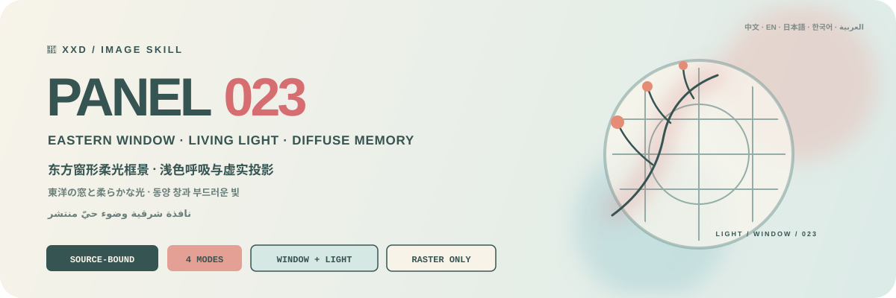

<p align="center">
  
</p>

<div align="center">

# 🦁 XXD Panel 023

### Frame the photograph in one source-responsive Eastern window and diffused living light

[](./SKILL.md)
[](#four-outputs-one-eastern-window-logic)
[](#boundaries-and-trust)

<a href="README.md">简体中文</a> · <strong>English</strong> · <a href="README.ja.md">日本語</a> · <a href="README.ko.md">한국어</a> · <a href="README.ar.md">العربية</a>

</div>

> SOURCE-CHOSEN WINDOW · PALE BREATHING GROUND · LIVING COLOURED LIGHT · SPRAY GRAIN · DIFFUSE PROJECTION

XXD Panel 023 is an image-generation Skill for Codex and compatible agents. According to source contour, action direction, opening, centre of gravity, and space, it chooses one round, patterned, perforated, moon, fan, hexagonal, or simplified lattice window, then lets the subject, branch shadow, light patch, or abstract projection appear within, pass through, occlude, or gently spill beyond it.

The ground is an extremely pale, low-saturation composite extracted from the source; its most vital colour becomes soft living light. One principal light zone, one quiet void, and a few diffused projections form a visual triangle. Fine spray grain, pastel dust, air-soft focus, and tiny editorial type make the image feel like lattice sunlight on a pale wall, gently blurred by air and memory.

## Why it exists

An “Eastern window scene” easily collapses into the same centred moon gate, fixed dark-blue ground, hard Chinese border, or cheap nostalgic filter, with the subject merely inserted into an unrelated template.

023 reverses that logic:

```text
lock source contour / action / opening / direction / light / colour / relation → choose one fitting traditional window → let subject or projection appear / pass through / occlude / spill → establish one principal light + one quiet void + a few soft projections → extract an extremely pale ground and living light colour → soften with spray grain, pastel dust, and diffuse edges → place an extremely short title and microtype along the edge, arc, axis, or light void
```

If an unrelated photograph could replace the source without materially changing window choice, subject-window relation, principal light, quiet void, projections, ground hue, living light colour, or type path, the result is not 023.

## The 023 visual contract

- **Source chooses the window:** at least three source-specific cues determine one window form; never default to one moon gate or stack several traditions.
- **Window and subject interact:** subject, branch shadow, light patch, or projection appears within, passes through, occludes, or spills so the frame creates order and depth.
- **One visual triangle:** one principal light, one quiet void, and a few soft projections create a stable centre; the window may be offset, cropped, or suspended.
- **Extremely pale source ground:** use a source-supported mist blue, pale cyan, soft apricot, powder pink, grey green, warm ivory, or pale violet-grey—never fixed dark blue or dirty grey.
- **Living light colour:** distil and gently lift the source's most vital colour for restrained warm-cool response, never a global filter.
- **Atmospheric material:** fine spray grain, pastel dust, powder, soft focus, and diffuse edges; lattice is slightly clearer but never hard.
- **Quiet microtype:** one extremely short title with sparse place/state words or micro-phrases follows the window edge, arc, axis, or light void.

## Samples · Coming soon

The repository reserves [`assets/examples/`](assets/examples/) for future work. Only finished 023 artwork verified by the project owner will be added; no post or image from another style is used as a placeholder.

Future samples will demonstrate 023's adaptability. Their subjects, metaphors, palette, copy, and canvas ratios will never become generation references or defaults.

## Four outputs, one Eastern-window logic

The four modes support single or multiple selection. Reply with `1`, `1+3`, `1,2,4`, or `all`; the Skill deduplicates and runs them in menu order 1→4. Every mode is delivered independently in its own task directory—never as an overview—and `all` yields seven PNGs per source (one for each ordinary mode plus four wallpapers). Sizes may be labelled by mode in the same reply; unlabeled ordinary modes remain source-adaptive. Copy is shared across selected modes by default and may be overridden per mode.

| Mode | Sizing logic | Deliverable |
| --- | --- | --- |
| `top-bottom` | source-adaptive | complete source above, 023 soft Eastern window-framed atmosphere below; both panels retain the source size and split exactly 50/50 |
| `left-right` | source-adaptive | complete source left, 023 soft Eastern window-framed atmosphere right; both panels retain the source size and split exactly 50/50 |
| `design-only` | source-adaptive | transformed design only, with no visible source photo; retains source ratio and dimensions |
| `wallpaper-pack` | four device sizes | separate phone, iPad, desktop, and children's-watch PNGs |

Exact user pixels > explicit ratio or destination > source adaptation for ordinary modes. The original `023.md` used a 3:4 creative canvas, but that historical example is not a silent default in the current Skill.

Photography in paired modes stays truthful, with only restrained grading and necessary environmental extension. Design-only and wallpapers still use the photograph as evidence but do not show it.

### Wallpaper packs: linked or independent

Wallpaper mode has no silent size default. Choose the common preset—phone `1440×3200`, iPad `2048×2732`, desktop `3840×2160`, watch `1024×1024`—or give labelled custom sizes.

- **Linked pack (recommended):** generate and approve the iPad anchor first; every other device references the original photo plus that same anchor and is recomposed for its canvas.
- **Independent set:** every device references only the source photograph and may explore a different few-form arrangement, positive/negative balance, colour area, asymmetric centre, and typographic reading path.

Linked never means cropped. All four files are separately generated, composed, and reviewed, with no iPad→phone→desktop→watch reference chain.

## Copy follows the window and light

Before generation, choose automatic copy, custom copy, or text-free output. Name the target language or locale whenever copy is present.

Automatic copy distils one extremely short title from visible or supported mood, time, action, temperature, or metaphor, adding only a few place words, state words, or micro-phrases when useful. Type stays very small and light, aligned, orbiting, offset, or interwoven along a window edge, arc, axis, or quiet light area.

Places, dates, provenance, and factual numbers must be supplied or reliably established and are never invented for sophistication. Exact user wording stays verbatim. Copy must still pass the unrelated-image swap test.

Finished user wording stays verbatim. A direction or editable draft is refined only while preserving audience, purpose, mandatory words, tone, and implication.

Language follows the intended audience rather than the command language:

```text
target market or audience > requested output language > direction language; if none is explicit, ask before generation
```

A Japanese edition uses natural Japanese, a Korean-audience edition uses natural Korean and correct spacing, a UK edition uses British English, and Arabic defaults to natural Modern Standard Arabic with genuine right-to-left composition. The Skill never guesses nationality from appearance, clothing, scenery, or signs and never uses pseudo-foreign text.

## Code guarantees geometry; image generation creates the artwork

The image model creates the source-responsive traditional window, subject-window depth, extremely pale ground, living coloured light, spray grain, pastel dust, soft focus, diffuse projection, and quiet microtype. `scripts/compose_panel.py` only plans canvases, performs exact 50/50 raster composition, finalises dimensions, and audits results. It never fakes artwork with programmatic drawing.

```bash
python3 scripts/compose_panel.py --plan --layout top-bottom --source photo.png
python3 scripts/compose_panel.py --plan --layout left-right --size 2560x1440
python3 scripts/compose_panel.py --audit result.png --layout design-only --size 2048x2048
```

Exact top-bottom canvases need an even total height; left-right canvases need an even total width. Requested pixels are never silently changed.

## Get started

```bash
git clone https://github.com/nevertoday/xxd-panel-023.git
mkdir -p ~/.codex/skills
ln -s "$(pwd)/xxd-panel-023" ~/.codex/skills/xxd-panel-023
```

Claude Code users may link the same directory to `~/.claude/skills/xxd-panel-023`. Restart the agent session after installation.

```text
$xxd-panel-023
Turn this photograph into a left-right composition. Derive the copy from the image and write it in natural Korean.
```

You may invoke the Skill with only a photograph. It first asks for one or more modes in a numbered multiline menu, then for copy settings; wallpaper mode also asks for linked/independent continuity and device sizes.

Full specifications:

- [Skill workflow](SKILL.md)
- [Chinese full prompt](references/xxd-panel-023-prompt.zh-CN.md)
- [English full prompt](references/xxd-panel-023-prompt.en.md)
- [Original style brief](references/023-source.md)

## Boundaries and trust

- Each photograph stays within its own task and never borrows subjects, colours, copy, or composition from other inputs, old results, or samples.
- Every invocation creates a fresh task directory; even identical sources and parameters must generate anew.
- Deliverables are PNG bitmaps, never SVG, HTML, Canvas, or programmatic-drawing substitutes.
- The configured bitmap bridge emits sanitised status only and does not expose providers, endpoints, headers, credentials, prompts, or response bodies.
- Each selected ordinary mode returns one file; selected `wallpaper-pack` adds four separate wallpapers. `all` returns seven PNGs per source across four sibling mode directories, never a contact sheet or overview.

Local composition needs Python 3 and Pillow. The safe bitmap bridge uses Python 3.11+ `tomllib`. Image generation still requires a host agent with built-in raster generation or an already configured compatible raster route.

## Repository

```text
xxd-panel-023/
├── SKILL.md
├── README.md / README.en.md / README.ja.md / README.ko.md / README.ar.md
├── agents/openai.yaml
├── assets/
│   ├── banner.svg
│   └── examples/ (reserved for future local samples)
├── scripts/
│   ├── compose_panel.py
│   └── configured_imagegen.py
└── references/
    ├── xxd-panel-023-prompt.zh-CN.md
    ├── xxd-panel-023-prompt.en.md
    └── 023-source.md
```

## About XXD

XXD is the abbreviated brand name of Xiaoxiaodong. This project is created and maintained by [@xiaoxiaodong01](https://x.com/xiaoxiaodong01).

## Support and Membership

### In-depth Consultation · CNY 299/hour

One-to-one consultation for using the Skills is billed at CNY 299 per hour. Contact Xiaoxiaodong through the WeChat QR code below to book.

### Xiaoxiaodong Skills User Community · CNY 99 to join

A one-time CNY 99 fee joins the community for workflow sharing, work discussion, and peer support. It does not include hourly one-to-one consultation. Include “Skills User Community” in your WeChat message.

### Knowledge Planet + Member Prompt Library · CNY 699/year

[Knowledge Planet](https://wx.zsxq.com/group/15554814142882) and the [XXD Member Prompt Library](https://vip.xiaoxiaodong.ai/) are one membership: **one annual payment unlocks both, with no second purchase required.**

1. Subscribe through [Knowledge Planet](https://wx.zsxq.com/group/15554814142882), then contact Xiaoxiaodong on WeChat for a Prompt Library redemption code.
2. Subscribe through the [Member Prompt Library](https://vip.xiaoxiaodong.ai/), then contact Xiaoxiaodong on WeChat for a Knowledge Planet invitation.

<p align="center">
  <a href="https://xiaoxiaodong.pages.dev/assets/wechat-qr.png"></a>
</p>

<div align="center">

**The window is not decoration; it is where subject, light, and quiet space happen together.**

</div>

---

<div align="center">
  <h2>☕ Support this open-source project</h2>
  <p>If this project saved you time, a Star, a share, or a coffee helps keep it moving.</p>
  <table>
    <tr>
      <td align="center" width="240">
        <a href="https://github.com/nevertoday/zhongguo-traditional-colors/blob/main/docs/images/buy-me-a-coffee-qr.png?raw=true"></a><br>
        <strong>Buy me a coffee</strong><br>
        <sub>Scan or open the QR code to support Xiaoxiaodong</sub>
      </td>
    </tr>
  </table>
  <p><sub>Support is entirely optional and never changes access to this open-source project.</sub></p>
</div>
